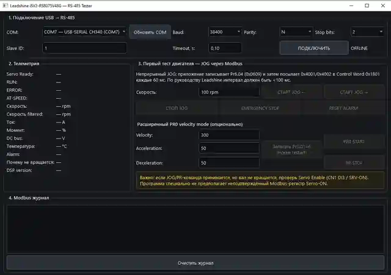

# Leadshine iSV2 RS-485 Tester

Windows/Python GUI for testing and controlling **Leadshine iSV2-RS8075V48G** over **Modbus RTU / RS-485**.

## Current bench defaults

- Baud: **9600**
- Data bits: **8**
- Parity: **None**
- Stop bits: **2**
- Slave ID: **16** when the drive RCS rotary switch is at `0` (current unit label/default)
- SW1/SW2/SW3/SW4: OFF for the current bench setup

## Features

- COM-port selection
- Modbus RTU connection test
- Auto-scan of common communication settings and IDs 16/8/1
- JOG left/right with configurable RPM
- Stop / emergency stop
- Alarm reset
- Telemetry: ready/run/error, RPM, current, torque, DC bus voltage, temperature
- Raw TX/RX Modbus log
- Optional PR0 velocity mode

## Install on Windows

1. Install Python 3.11 or 3.12 x64.
2. Run `install.bat`.
3. Run `start.bat`.

See `README_RU.txt` for wiring and detailed Russian instructions.
